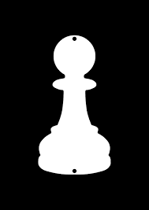

<div align="center">

# 

A Standalone PCB Chess Board with OnBoard Machine

<p>


</p>

### _A chess board that sees every piece, lights every move, and thinks alongside you - no external modules required._

</div>

---

# Overview

**Chess Master Board** is a fully self-contained phisical chess board built on a custom PCB.

64 hall effect sensors beneath the board that give us the ability to track every single piece in real time. 64 addressable RGB LEDs that communicate with us about the game state directly trough the board surface - valid moves, check warnings, captures and chess engine suggestions in order for the player to achieve the best results againts its opponent or achieve a greater knowledge.

The entire system runs standalone on an **ESP32-S3-WROOM-2**. No companion app, no Bluetooth pairing step, no internet connection. The onboard chess engine (mcu-max, with the power of giving the player ~2000ELO suggestions at a depth of 8-10) computes the best move and with the power of the RGB LEDs the player recieves the recommendations and dangers on the board itself.

Built as an open-source hardware product - every schematic, PCB file and line of firmware is available to reproduce, modify and improve.

---

# Gallery


---

# Zine


---

# Motivation

Some people (like me :)) want to play the game in real life but seem to lack the power of quick computer suggestions while they lose to their opponent. Ofcourse you can achieve that on your smartphone or a PC but what if you dont want to use your digital hardware for playing the game???

With that issue on my mind i created **Chess Master Board** with a different concept:

> _What if the board itself was the computer?_

The design is inspired by the tactile satisfaction of phisical chess and analytical depth of computer engines:

- No screen needed - the board communicates through light
- No connection needed - the engine runs entirely on device
- No compromise on piece feel - real magnets, real sensors, real board
- Shipped and open-sourced product so anyone can build it, modify it and improve it

The project is also an increidible journey into embedded hardware and PCB design for any enthusiast willing to endulge himself into the type of engineering.

---

# Assebly Guide

## Hardware

### 1. Order the PCB

Navigate to:

```bash
Hardware/Gerbers/
```

Upload the included Gerber files to your preferred PCB manufacturer and order the boards.

### 2. Order the Components

Whether you want to order it trough a PCBA concept or to solder it manually you should refer to the BOM file.

```bash
Hardware/BOM/BOM.csv
```

Order all parts before starting your assembly and sort them out because there will be a lot of them.

## 3. Solder SMD Components

Considering that you have chosen to solder them personally you should follow the following steps:

Start with the smallest SMD passives before moving to ICs:

- Hall effect sensors (AH1806-W-7) on the front face, one per square
- Shit register ICs (74HC165BQ) on the front
- Level shifter (SN74AHCT125D) for APA102C data lines
- LiOn charger IC and its passive components available in the schematic


Recommended tools:
- Flux
- A strong soldering iron with a fine-tip
- Tweezers
- Solder paste + hot air
- Helping hands with a magnifying glass

### 4. Install the LED Array

- Solder all 64 APA102C RGB LEDs onto the Upper PCB.
- These are oriented - check the cathode marker on each pad before placing.
- Ensure every LED sits completely flat before reflow

### 5. Install the ESP32-S3 Module

- Solder the ESP32-S3-WROOM-2 module onto its castellated pads.
- Verify the antenna area is clear - no copper, no components within the 15mm keepout zone (except the screw nearby).
- Confirm via grid under the module makes solid contact with the EPAD ground pads.

### 6. Install the OLED Display

- Solder or socket the SSD1306 128x64 OLED in its designated position
- Double-check I2C address.

### 7. Install Buttons, Switch, and COnnectors

- Solder both player clock buttons (active-LOW, external pull-ups already on PCB).
- Solder the USB-C charging connector.

### 8. Install Bettery Holders

- Insert both LiOn 18650 battery holders and confirm polarity marking before connecting cells.
- Do not connect LiOn cells untill all soldering is complete

### 9. Assemble the Enclosure

- ...

### 10. Install Chess Pieces

- Each chess piece has a designated hole for inserting magnets on the bottom with size (YxZ)
- Magnet polarity must be consistent - south pole facing down towards the sensors of the board.
- Verify detection by powering the board and placing a piece on each starting square during the first boot.

---

## Firmware Installation

### 1. Install ESP-IDF

```bash
git clone --recursive https://github.com/espressif/esp-idf.git ~/esp/esp-idf
cd ~/esp/esp-idf
./install.sh esp32s3
source ./export.sh
```

Follow the [official Espressif guide](https://docs.espressif.com/projects/esp-idf/en/stable/esp32s3/get-started/index.html) for WIndows and macOS variants.

### 2. Clone the Repository

```bash
git clone https://github.com/Ajakovski/chess-master-board.git
cd chess-master-board
```

### 3. Set Target and Build

```bash
idf.py set-starget esp32s3
idf.py build
```

### 4. Flash the Firmware

Connect via USB-C. If the board does not enter download mode automatically, hold **BOOT** and tap **EN**, then release BOOT.

```bash
# Linux
idf.py -p /dev/tty/USB0 flash

# macOS
idf.py -p /dev/cu.usbserial-XXXX flash

# Windows
idf.py -p COM3 flash
```

### 5. Monitor Serial Output

```bash
idf.py -p /dev/ttyUSB0 monitor
```

Exit with 'Ctrl+]'.

---

# BOM

...

---

# Features

- **Real Piece Detection** - 64 hall effect sensors, one per square
- **RGB LED Feedback** - valid moves, check, captures, engine suggestions
- **Onboard Chess Engine** - mcu-max, ~1800-2000 ELO at depth 8-10, fully integrated
- **Dual Player Clocks** - dedicated hardware button per player
- **OLED Display** - game state, clocks, engine status, battery level
- **Battery Powered** - dual LiOn with onboard USB-C charging
- **Deep Sleep** - power saving mode and game state retained in RTC memory across scleep cycles
- **Fully Custom PCB** - designed for shipping standards
- **Open Source** - complete hardware + firmware available

---

# Hardware Stack

...

---

# PCB Design

The PCB was designed specifically for this project and its layout.

Key design requirements met:
...

## PCB Layout


## Schematic
### Main PCB


### Upper PCB


### Clock PCB


## Component Placement


---
# Enclosure
- ...


---

# Firmware (ESP-IDF)

Firmware features:
- FreeRTOS game state machine
- HAL drivers for all peripherals
- mcu-max chess engine integration (UCI interface, iterative deepening)
- Deep sleep with RTC memory retention
- Shared CLK sequencing between APA102C and 74HC165 chains

```bash
Chess-Master-Board/
|--- Firmware/
|    |--- main/
|        |--- hal/ # LED, sensor, OLED, button, battery drivers
|        |--- engine/ # mcu-max integration
|        |--- game/ # FreeRTOS state machine + chess rules
|        |--- main.c/
|--- Hardware/
|    |--- Schematic/
|    |--- PCB/     
|    |--- Gerbers/  
|--- Pictures/
|--- README.md
```

---

# Current Status
- [X] Initial Concept
- [X] Layout Finalized
- [X] PCB Design
- [X] Schematic
- [X] Firmware - HAL Drivers
- [X] Firmware - Game State Machine
- [X] Chess Engine Integration
- [X] Deep Sleep + RTC Retention
- [X] Battery Monitoring
- [X] 3D Models
- [X] Final BOM
- [ ] Assembly Zine
- [ ] Final Build

---

# Contributing

Contributions, suggestions and feedback are welcome!!!

If you'd like to improve Chess Master Board:

1. Fork or clone the repository
```bash
git clone https://github.com/Ajakovski/chess-master-board.git
cd chess-master-board
```

2. Create your feature branch (if forked)
3. Commit your changes
4. Opena a pull request

For significant hardware changes, open an issue first to discuss before investing time in layout work. Any new HAL driver must be self-contained in its own `.c`/`.h` pair.

If you build one, open an issue with photos.

---

# Creator

### Ajakovski aka. Marsovac
Hey my name is Andrej and im from Macedonia, Kratovo. Im 17 years old and i really enjoy making cool project which are all posted on my github.

Main focus while building the project:
- embedded systems engineering
- schematic construction and following electrical concepts
- first PCB construction EVER!!!
- phisical product design
- to participate Fallout from HackClub
- connect with other likewise enthusiasts
- chess

---

# License

This project is licensed under the **MIT License** - see [LICENSE](LICENSE) for full terms.

Chess engine: [mcu-max](https://github.com/Gissio/mcu-max) - MIT License

---

<div align="center>

## CHESS MASTER BOARD

### _Every mode, illuminated._

</div>