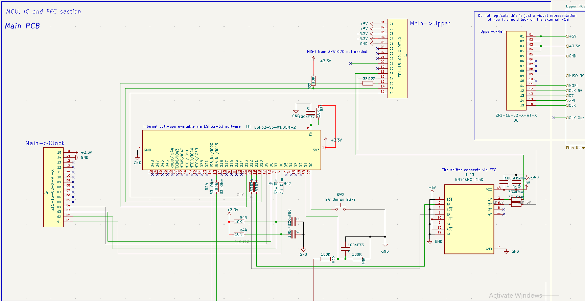

<div align="center">


# A Standalone PCB Chess Board with OnBoard Machine

<p>


</p>

### _A chess board that sees every piece, lights every move, and thinks alongside you - no external modules required._


</div>

---

# Overview

**Chess Master Board**

With the power of electro-magnetism this master board is capable of reading every move that the players are making. The powerfull chip with the built in machine gives us the power of a ~2000 ELO player that computes the best moves ***within 2 seconds*** and finally the built in RGB LED matrix sends light signals towards the player with the best move suggestions for you to beat every opponent.

A completely standalone project that requires no external connection gives us the ability to use this board anywhere that we want to. Thanks to the sleep-mode option we recieve a massive battery life extention and we can move on with the game just in case if we decided to pause it.

The chess machine follows every official chess rule and it has included every possible recommendation pattern thanks to the RGB LED matrix. Just put the pieces on their starting squares, press the two buttons for a short period of time and ***ENJOYYY***

Built as an open-source hardware product - every schematic, PCB file and line of firmware is available to reproduce, modify and improve.

---


# Zine

<div align="center">


</div>

---

# Motivation

Some people (like me :)) want to play the game in real life but seem to lack the power of quick decision making while they lose to their opponent. Ofcourse you can achieve that on your smartphone or a PC with a helper like stockfish but what if you dont want to use your digital hardware for playing the game???

With that issue on my mind i created **Chess Master Board** with a different concept:

> _What if the board itself was the computer?_

**The helping buddy that you need!** Hidden inside of the medium sized chess board with just a 5 second double hold on the buttons you awake the mastermind that will help you againts any enemy.

The design is inspired by the tactile satisfaction of phisical chess and will to win your opponents while they struggle for survial:

- No screen needed - the board communicates through light
- No IoT connection needed - the engine runs entirely on device
- Shipped and open-sourced product so anyone can build it, modify it and improve it

The project is also an increidible journey into embedded hardware and PCB design for any enthusiast willing to endulge himself into the type of engineering.

---

# Assembly Guide

## Hardware

***Notice: Always follow the order Main→Upper→Clock PCB for assembling the hardware***

***A visual representation of the whole project has been given with the file:***

***If you dont prefer via the files you can always refer to the visual representation via [OnShape](https://cad.onshape.com/documents/13dd493447813ae98dcbc5b6/w/f13770b66ce0189c65580405/e/d896ca2ed77523ba709b8a3c?renderMode=0&uiState=6a33bc9ec68ee69fbb85f0c4).***

```bash
Hardware/FULLY_ASSEMBLED_PROJECT.step
```

### 1. Order the PCBs and 3D Model

Navigate to: (For PCBs)

```bash
Hardware/KiCad/Gerbers/
```

*Upload the included Gerber files to your preferred PCB manufacturer and order the boards.*

Navigate to: (For 3D Model)
```bash
Hardware/3D_Printing/ (Both zip files)
```
Due to github memory restrictions they are split into 2 files. G-code Pieces features the black/white collection of pieces ready for printing and the V3 Chess 3D.zip is equipped with the full set of information and g-code files for printing the board.
There is also a step version of the files from V3 Chess 3D.zip file, use those also if you need them.

*Upload the G-Code files to your preferred manufacturer and order the parts.*

*The latest version is recommended but if you prefer any older version feel free to use it.*

### 2. Order the Components

Whether you want to order it trough a PCBA concept or to solder it manually you should refer to the BOM file.

```bash
Hardware/BOM.csv
Hardware/Component Libraries.zip
```
All of the files for the components are placed into a zip file due to memory constraints.

Order all parts before starting your assembly and sort them out because there will be a lot of them.

### 3. Solder SMD Components

Considering that you have chosen to solder them personally you should follow the following steps:

Start with the smallest SMD passives before moving to ICs (Refer to the schematic alway before soldering):

- All 0402 decoupling capacitors (100nF) across the board
- Bulk capacitors (1μF, 4.7μF, 10μF, 22μF) near power Ics
- USB-C CC resistors (5.1KΩ)
- All signal and bias resistors per schematic

Recommended tools:
- Flux
- A strong soldering iron with a fine-tip
- Tweezers
- Solder paste + hot air
- Helping hands with a magnifying glass

### 4. Solder Power ICs

Solder the power subsystem in order - validate each stage before starting the next:

- **U3** (BQ24074RGT) - Li-Ion charger, VQFN-16. Solder with hot air; confirm EPAD contact/
- **TH1** (NTC thermistor) - battery temperature input for the charger IC
(Notice: If you are unable to find an NTC thermisto, a 10K ohm resistor will work just fine as a subsitude)
- **U4** (TPS61023DRLT) + **1uH1** (XEL4030-102MEC) - 5V boost converter for LED rail.
- **U5** (AP2112K-3.3TRG1) - 3.3V LDO for ESP32 and logic
- **U145, U146** (REUF300) - PTC resettable fuses on power rails
- **U144** (USBLC6-2P6) - USB ESP protection
- **J2** (USB4110GFA) - USB-C receptacle 
- **D1, D2** - charging status LEDs

Verify whether 5V and 3.3V rails are correct before including anything else.

### 5. Solder the Sensor and Shift Register Array

- **U79-U142** - 64x AH1806-W-7 hall effect sensors (SOT-23, active-LOW)
- **U6-U13** - 8 74HC165BQ shift registers (SSOP-16/QFN, daisy chained)
- Verify sensor orientation - pin 1 marker must align with PCB silkscreen

### 6. Solder the LED Array

- **U14-U77** - 64x APA102C RGB LEDs (5050)
- Theese are orientations-sensitive - follow the schematic and confirm the cathode corner marker before placing every row
- Ensure every LED sits completely flat before reflow; a lifted pad will break the entire following part of the chain.

### 7. Solder the Level Shifter

- **U143** (SN74AHCT125D) - bridges the ESP32's 3.3V outputs to the 5V APA102C DATA and CLK lines
- Without this component the APA102C will be under constant failirue.

### 8. Install the ESP32-S3 Module

- Solder **U1** (ESP32-S3-WROOM2) onto its castellated pads.
- The antenna area requires a **15mm keepout zone** on the base PCB - no copper, no vias (except the screw nearby).
- Confirm the via grid under the module makes solid contact with all EPAD ground pads

### 9. Install the Display and Connectors
- **DS2** - 2.23" 128x32 OLED, I²C interface
- **J1/J4 on Main PCB** Samtec ZF1-15-92-X-WT-X board connectors
- **J3 on Upper PCB** Samtec ZF1-15-92-X-WT-X board connectors
- **J7 on Clock PCB** Samtec ZF1-15-92-X-WT-X board connectors

### 10. Install User Interface Components

- **S3, S4** (TL3315NF250Q) - player clock buttons
- **SW2** (Omron B3FS) - Boot button

### 11. Install Battery Holders and Cells

- Solder **BT1, BT2** (Keystone 1043) - 18650 cell holders
- Do not insert cells untill all soldering is fully complete
- Confirm polarity markings on PCB silkscreen before inserting cells

### 12. Assemble the Enclosure

***Materials needed for assembling:***

- 32x Neodymium magnet in circle with dimensions: 20mm diameter x 5mm height
- 6x Neodymium magnet in a rectangle with dimensions 5x10x2mm
- Glue, any type just make sure to get a strong one
- 11x M3 screw nuts (more is fine in case you loose some)
- Notice: If you dont get screws with the OLED screen you will have to acquire them personally

***Steps for assembling***

The main part of the assembling is sticking the magnets in their appropriate places. 
There are 2 places where they should be placed:
- The rectangular magnets should be placed 3x on the lid used for closing the bottom of the chess board where on one side you will find 3 rectangular holes and 3x inside of the chess board where you will the same 3 rectangular insertions. Apply glue inside of them and stick the magnets inside. **BE CAREFUL** and place the pair of three magnets with opposite polarities. So if the closing lid has the north pole facing outwards, make sure to have the south pole facing outwards on the chess board.
- The circular magnets are designated to go into the chess pieces. Same procedure, apply glue and stick them. **Make sure to place the south pole outwards because otherwise the hall effect sensors will have a poor reading**
- Every PCB has their own designated screw holes and how they should be placed. **Every PCB next to the screw hole has the side on where it should be placed.** (for eg. UR- Upper Right, DR - Down Right)
- The Push buttons should be inserted from inside of the chess board before putting the screws on for the Clock PCB so that the buttons stay locked on top of the buttons built-in on the PCB.
- Verify detection by powering the board and placing every piece on their starting square during first boot.


---

## Firmware Installation

### 1. Install ESP-IDF

```bash
git clone --recursive https://github.com/espressif/esp-idf.git ~/esp/esp-idf
cd ~/esp/esp-idf
./install.sh esp32s3
source ./export.sh
```

Follow the [official Espressif guide](https://docs.espressif.com/projects/esp-idf/en/stable/esp32s3/get-started/index.html) for WIndows and macOS variants.

### 2. Clone the Repository

```bash
git clone https://github.com/Ajakovski/chess-master-board.git
cd chess-master-board
cd Firmware
```

### 3. Set Target and Build

```bash
idf.py set-starget esp32s3
idf.py build
```

### 4. Flash the Firmware

Connect via USB-C. If the board does not enter download mode automatically, hold **BOOT** and tap **EN**, then release BOOT.

```bash
# Linux
idf.py -p /dev/tty/USB0 flash

# macOS
idf.py -p /dev/cu.usbserial-XXXX flash

# Windows
idf.py -p COM3 flash
```

### 5. Monitor Serial Output

```bash
idf.py -p /dev/ttyUSB0 monitor
```

Exit with 'Ctrl+]'.

---

# BOM

**If you are refering from the BOM.csv file please use a converter csv to table because it will be hard for you to read the documentation. And as always you can recall from my githubs BOM anytime you want**

| Designator | Function | Value / Part | Package | Qty | Price (USD) | Link |
|---|---|---|---|---|---|---|
| U1 | MCU Module | ESP32-S3-WROOM-2 N32R16V | LCC-54 | 1 | $12 | [Mouser](https://www.mouser.bg/ProductDetail/Espressif-Systems/ESP32-S3-WROOM-2-N32R16V?qs=%252BHhoWzUJg4Kf%2FwmS40wg%252BQ%3D%3D&srsltid=AfmBOopjud5fwNEdPJr_Fcp_F6RRXBi_0mpNTvMmjx49w7TWEqiv5xGV) |
| U79–U142 | Hall Effect Sensor | AH1806-W-7 | SOT-23 | 64 | $20 | [Mouser](https://www.mouser.com/ProductDetail/Diodes-Incorporated/AH1806-W-7?qs=eSfX1CQlHqqRKgthoXGrzg%3D%3D&srsltid=AfmBOoqvt9XKLP8jc6GHH0L_jmNus1_TszQpJJyJu60i3bDtAeJsRl4r) |
| U6–U13 | Shift Register | 74HC165BQ_115 | QFN-17 | 8(10) | $2.21 | [Mouser](https://www.mouser.bg/ProductDetail/Nexperia/74HC165BQ115?qs=P62ublwmbi86viaf9iloMA%3D%3D&srsltid=AfmBOop67e87aW457vff1BOXmou8TWC8JPC6vrp5882xNvyS27eVy15c) |
| U14–U77 | Addressable RGB LED | APA102C | SON-6 (5050) | 64(100) | $10.5 | [AliExpress](https://www.aliexpress.com/item/1005008174203527.html) |
| U143 | Level Shifter | SN74AHCT125DR | SOIC-14 | 1 | $0.46 | [Mouser](https://www.mouser.bg/ProductDetail/Texas-Instruments/SN74AHCT125DR?qs=B7lSdIxWQkm9VQkJOjfRaA%3D%3D) |
| DS2 | OLED Display | 128×32 2.23" I²C | SSD1305 | 1 | $10 | [AliExpress](https://www.aliexpress.com/item/1005008489357042.html?spm=a2g0o.productlist.main.9.1cd31P5n1P5nfd&algo_pvid=10006fad-7505-426f-8c02-2c3dbc745dfc&algo_exp_id=10006fad-7505-426f-8c02-2c3dbc745dfc-8&pdp_ext_f=%7B%22order%22%3A%229%22%2C%22eval%22%3A%221%22%2C%22fromPage%22%3A%22search%22%7D&pdp_npi=6%40dis%21MKD%21567.22%21567.22%21%21%2165.40%2165.40%21%40212e520f17815127163675148eea9b%2112000045367691230%21sea%21MK%210%21ABX%211%210%21n_tag%3A-29910%3Bd%3Aaeed944%3Bm03_new_user%3A-29895&curPageLogUid=1Bi8k4hGK8K7&utparam-url=scene%3Asearch%7Cquery_from%3A%7Cx_object_id%3A1005008489357042%7C_p_origin_prod%3A#nav-description) |
| BT1, BT2 | 18650 Battery Holder | Keystone 1043 | THT | 2 | $6.82 | [Mouser](https://www.mouser.com/ProductDetail/Keystone-Electronics/1043?utm_campaign=mouser&qs=%2F7TOpeL5Mz6j%2FnxeOA1rsg%3D%3D&utm_medium=online&utm_source=snapedaonline&utm_content=modelunipart_id=214578&manufacturer=Keystone) |
| U3 | Li-Ion Charger IC | BQ24074RGT | VQFN-16 | 1 | $2.48 | [Mouser](https://www.mouser.bg/ProductDetail/Texas-Instruments/BQ24074RGTR?qs=ZV%2Fxhq4oszp2Nll7fIx5wg%3D%3D&srsltid=AfmBOopf_GDP2yO0D5PAa7cuepwFxpUxXFdTjUaKyMCHw1c4K6qqB7_Z) |
| U4 | Boost Converter (5V) | TPS61023DRLT | SOT-6 | 1 | $1.4 | [Mouser](https://www.mouser.bg/ProductDetail/Texas-Instruments/TPS61023DRLT?qs=BJlw7L4Cy78Zr3IJIU3gNw%3D%3D) |
| 1uH1 | Power Inductor | XEL4030-102MEC (1µH) | XEL4030 | 1 | $2.17 | [Mouser](https://www.snapeda.com/api/url_track_click_mouser/?unipart_id=4653188&manufacturer=Coilcraft&part_name=XEL4030-102MEC&search_term=None) |
| U5 | 3.3V LDO Regulator | AP2112K-3.3TRG1 | SOT-25 | 1 | $0.25 | [Mouser](https://www.mouser.bg/ProductDetail/Diodes-Incorporated/AP2112K-3.3TRG1?qs=x6A8l6qLYDDPYHosCdzh%2FA%3D%3D) |
| U144 | USB ESD Protection | USBLC6-2P6 | SOT-666 | 1 | $0.63 | [Mouser](https://www.mouser.bg/ProductDetail/STMicroelectronics/USBLC6-2P6?qs=6ARB0lp6jlViGcbUSvj1Mw%3D%3D) |
| U145, U146 | PTC Resettable Fuse | RUEF300 (3A) | Radial | 2 | $1 | [AliExpress](https://www.aliexpress.com/item/1005003699936643.html?spm=a2g0o.productlist.main.2.1515qUETqUETL7&algo_pvid=1ab326b7-57ac-4a5e-9c91-1f0688d12436&algo_exp_id=1ab326b7-57ac-4a5e-9c91-1f0688d12436-1&pdp_ext_f=%7B%22order%22%3A%2269%22%2C%22eval%22%3A%221%22%2C%22fromPage%22%3A%22search%22%7D&pdp_npi=6%40dis%21MKD%2140.94%2140.94%21%21%210.70%210.70%21%402101529317817805763092080ee682%2112000026854019128%21sea%21MK%210%21ABX%211%210%21n_tag%3A-29910%3Bd%3Acd05e435%3Bm03_new_user%3A-29895&curPageLogUid=hEJCwyMy2faS&utparam-url=scene%3Asearch%7Cquery_from%3A%7Cx_object_id%3A1005003699936643%7C_p_origin_prod%3A) |
| TH1 | NTC Thermistor | NTCG103JF103FT1S | 0402 | 1 | $0.11 | [Mouser](https://www.mouser.bg/ProductDetail/TDK/NTCG103JF103FT1S?qs=cNoPOocMWw11FEwwc%2F4vOg%3D%3D) |
| J2 | USB-C Receptacle | USB4110GFA | SMD | 1 | $1.27 | [Mouser](https://www.mouser.com/ProductDetail/GCT/USB4110-GF-A?qs=KUoIvG%2F9IlYiZvIXQjyJeA%3D%3D&srsltid=AfmBOoqFJ-91enIyu9A26tSaC9mGIXgz0BrHN1BArDjjXIR4G4HD0bAR) |
| J1, J3, J4, J7 | Board Connector | Samtec ZF1-15-02-X-WT-X | SMD | 4 | $6.8 | [Mouser](https://www.mouser.bg/ProductDetail/Samtec/ZF1-15-02-TM-WT?qs=%252BZP6%2F%252BtExtBQirvzLIJzEA%3D%3D) |
| S3, S4 | Player Clock Button | TL3315NF250Q | SMD | 2 | $0.28 | [Mouser](https://www.mouser.bg/ProductDetail/E-Switch/TL3315NF250Q?qs=g35H13458Kaz43%252B3owu1iQ%3D%3D) |
| SW2 | Boot Switch | Omron B3FS | SMD | 1 | €0.62 | [Mouser](https://www.mouser.bg/ProductDetail/Omron-Electronics/B3FS-1000P?qs=ImaqFqjHA4k6odVF2%2FXWpQ%3D%3D) |
| D1, D2 | Charging LED | Q65111A7377 | 0402 | 2 | $0.92 | [Mouser](https://www.mouser.com/ProductDetail/ams-OSRAM/Q65111A7377?qs=sGAEpiMZZMv0DJfhVcWlKwb9uSCDLxPf%2FYHVt4kOg1XhmEL4WLxLEQ%3D%3D) |
| R3, R4 | USB-C CC Resistor | 5.1kΩ | 0402 | 2 | $0.20 | [Mouser](https://www.mouser.bg/ProductDetail/YAGEO/RC0402FR-075K1L?qs=YUgVZYePFqCSmQuaha43RA%3D%3D) |
| R5 | Charge Current Set | 800Ω | 0402 | 1 | $0.10 | [Mouser](https://www.mouser.bg/ProductDetail/SEI-Stackpole/RMCF0402FT806R?qs=IPgv5n7u5Qa32gYJEFJiUQ%3D%3D) |
| R6 | Charge Set | 1.2kΩ | 0402 | 1 | $0.10 | [Mouser](https://www.mouser.bg/ProductDetail/YAGEO/RC0402JR-071K2L?qs=KuCtQF8z8nDVvRd2gRh7cw%3D%3D) |
| R7, R107, R108 | Charge Set | 2kΩ | 0402 | 3 | $0.30 | [Mouser](https://www.mouser.bg/ProductDetail/YAGEO/RC0402FR-072KL?qs=V1yeUXFNrkkvY0qFpE7ijg%3D%3D) |
| R8, R11, R13, R35, R36 | Pull / Bias | 100kΩ | 0603 | 5 | $0.50 | [Mouser](https://www.mouser.bg/ProductDetail/YAGEO/RC0603FR-07100KL?qs=e1ok2LiJcmaihem8Va5%2Fsw%3D%3D) |
| R9 | Pull / Bias | 100kΩ | 0402 | 1 | $0.10 | [Mouser](https://www.mouser.bg/ProductDetail/YAGEO/RC0402FR-07100KL?qs=mnq%2FyloZIXzTlUn7JAHSWg%3D%3D) |
| R12 | Bias | 750kΩ | 0805 | 1 | $0.10 | [Mouser](https://www.mouser.bg/ProductDetail/Bourns/CR0805-FX-7503ELF?qs=Ek4EPvi0xiD1ZaaiTWdU0w%3D%3D) |
| R10 | Current Limit | 330Ω | 0402 | 1 | $0.10 | [Mouser](https://www.mouser.bg/ProductDetail/YAGEO/RC0402FR-07330RL?qs=V1yeUXFNrkngRWHRQxns%2Fg%3D%3D) |
| R16–R19, R23, 39,40, R43, R44, R45-R106 | Pull-up / Pull-down | 10kΩ | 0402 | 71 | $0.77 | [Mouser](https://www.mouser.bg/ProductDetail/YAGEO/AC0402FR-0710KL?qs=yhV1fb9g%2FKYkR5U3B7upEQ%3D%3D) |
| R34 | Pull-up / Pull-down | 10kΩ | 0201 | 1 | $0.10 | [Mouser](https://www.mouser.bg/ProductDetail/YAGEO/RC0201FR-0710KL?qs=FLc6udek5PS1AiJCgpc6bQ%3D%3D) |
| R14, R15, R22, R24, R25, R30, R31, R41, R42 | Series Damping | 33Ω | 0402 | 9 | $0.9 | [Mouser](https://www.mouser.bg/ProductDetail/YAGEO/RC0402JR-0733RL?qs=uM1JSSdPjOAuJ%2F4ZF3IeKA%3D%3D) |
| R37 | Voltage-divider | 3.3kΩ | 0402 | 1 |$0.1 | [Mouser](https://www.mouser.bg/ProductDetail/YAGEO/RC0402JR-103K3L?qs=qpJ%252B%252B%252Bdg6p211Yj14a%2Fidg%3D%3D)
| R38 | Voltage-divider | 6.8kΩ | 0402 | 1 |$0.27 | [Mouser](https://www.mouser.bg/ProductDetail/Panasonic/ERJ-H2RD6801X?qs=sGAEpiMZZMtlubZbdhIBIGXWvNSLmQjepnVQul72bkc%3D)
| C (various) | Decoupling / Bulk | 100nF, 1µF, 4.7µF, 10µF, 22µF | 0402/0603/0805/1206 | 105 | $16 | [Amazon](https://www.amazon.com/Bridgold-111Types-Capacitor-1pF-10uF-3-9pF-22uF/dp/B0C196FBK3/ref=sr_1_10?dib=eyJ2IjoiMSJ9.Sik-1N6T3B22pMHx3gZwssQe9HV9aXahGuDaX-uB1yfBLuMOqud5ObrWRTFUEP5qQT2cI_n6L6fgTxfF61UY6m7jwAR2JlYfwWtNi5UCKX4QVam3zu4P14UT01DyXCllphzxt5CmLBpMIcKJr-lpdFgCHgOWfw1AMDWRa0VJgoOHSTB1Ejcqxwg_bRNHyVE3csjNCQKdCS_s7IOfQRityBtC0y6ZoSuw4EYrFxCoT9w.R-0uFALOYO601m_UiLGERn05S21OQveJX7LUG-RrBD0&dib_tag=se&keywords=SMD%2BCapacitor&qid=1781345348&sr=8-10&th=1) |
| C17, C18 | CP_EIA-7343-20_Kemet-V | 100µF | 2917 | 2 | $8.68 | [Mouser](https://www.mouser.bg/ProductDetail/KEMET/T494V107K016AT?qs=esDHISMOsl1F06bDLafyPA%3D%3D) |
| Neodymium magnets | Circle | N35-N52 | 20x5cm | 32(40) | $20 | [Amazon](https://www.amazon.com/TRYMAG-Decorative-Neodymium-Powerful-Scientific/dp/B0G4D78X7T/ref=pd_ci_mcx_di_int_sccai_cn_d_sccl_1_7/136-7378115-7020437?pd_rd_w=JVAsz&content-id=amzn1.sym.751acc83-5c05-42d0-a15e-303622651e1e&pf_rd_p=751acc83-5c05-42d0-a15e-303622651e1e&pf_rd_r=S49NM63KZQJV9PRHP6W2&pd_rd_wg=72OFc&pd_rd_r=0b37500f-f078-4104-9d5c-44c4b33a4363&pd_rd_i=B0FG839Q2X&th=1) | 
| Neodymium magnets | Rectangular | N35-N52 | 5x10x2mm | 6(100) | $7.6 | [Amazon](https://www.amazon.com/dp/B0GK8XXS5P/ref=sspa_dk_detail_right_aax_0?sp_csd=d2lkZ2V0TmFtZT1zcF9kZXRhaWxfcmlnaHRfc2hhcmVk&th=1) |
| BT1, BT2 | Li-ion Battery  | 3.7V 3400mAh | 18650 | 2 | $5.76 (I have them) | [AliExpress](https://www.aliexpress.com/item/1005008704323807.html?spm=a2g0o.productlist.main.11.41426338JMDLOG&algo_pvid=5468ca2c-7ea9-4975-b4e9-84117a248739&algo_exp_id=5468ca2c-7ea9-4975-b4e9-84117a248739-10&pdp_ext_f=%7B%22order%22%3A%22594%22%2C%22eval%22%3A%221%22%2C%22fromPage%22%3A%22search%22%7D&pdp_npi=6%40dis%21MKD%21589.61%21306.60%21%21%2168.00%2135.36%21%40212a70c017813517499738402e1745%2112000046318715827%21sea%21MK%210%21ABX%211%210%21n_tag%3A-29910%3Bd%3Aaeed944%3Bm03_new_user%3A-29895&curPageLogUid=c8XERDHzRrxn&utparam-url=scene%3Asearch%7Cquery_from%3A%7Cx_object_id%3A1005008704323807%7C_p_origin_prod%3A)
| X | FFC Connector | 15-pin | 500mm | 3 | $6.82 | [Amazon](https://www.amazon.com.be/-/en/Flexible-Ribbon-Cable-Camera-Module/dp/B07P8Z27ZY?language=en_GB)|
| X | M3 Screws | M3 | 10mm | 50 | $5.5 | [AliExpress](https://www.aliexpress.com/item/33028169759.html?spm=a2g0o.productlist.main.48.53865b5fAhCGwY&algo_pvid=629709d9-a21f-428c-aced-7c4376ca24fc&algo_exp_id=629709d9-a21f-428c-aced-7c4376ca24fc-45&pdp_ext_f=%7B%22order%22%3A%22366%22%2C%22eval%22%3A%221%22%2C%22fromPage%22%3A%22search%22%7D&pdp_npi=6%40dis%21AED%215.37%213.75%21%21%211.42%210.99%21%402102f0cc17811144146558226e9158%2112000025630870148%21sea%21AE%216550317333%21ABX%211%210%21n_tag%3A-29910%3Bd%3A9c10be3c%3Bm03_new_user%3A-29895%3BpisId%3A5000000204469934&curPageLogUid=FOQQuqUMxISX&utparam-url=scene%3Asearch%7Cquery_from%3A%7Cx_object_id%3A33028169759%7C_p_origin_prod%3A&gatewayAdapt=ara2glo) |
| X | M3 Nuts | M3 | | 25 | $3.5 | [AliExpress](https://www.aliexpress.com/item/32978551452.html?spm=a2g0o.productlist.main.1.7c154ece9D2Th2&algo_pvid=84088476-8a89-43b9-a92f-5755b7a463e3&algo_exp_id=84088476-8a89-43b9-a92f-5755b7a463e3-0&pdp_ext_f=%7B%22order%22%3A%222796%22%2C%22eval%22%3A%221%22%2C%22fromPage%22%3A%22search%22%7D&pdp_npi=6%40dis%21MKD%21254.64%21254.06%21%21%214.36%214.35%21%40210156fc17816089059113153e1450%2112000015835866719%21sea%21MK%210%21ABX%211%210%21n_tag%3A-29910%3Bd%3Aaeed944%3Bm03_new_user%3A-29895&curPageLogUid=wct4KENxKUYh&utparam-url=scene%3Asearch%7Cquery_from%3A%7Cx_object_id%3A32978551452%7C_p_origin_prod%3A)|
| X | Main PCB | PCBWAY as second alternative | |5|70$|[JLCPCB](https://jlcpcb.com/)|
| X |Upper PCB| | |5|130$|[JLCPCB](https://jlcpcb.com/)|
| X |Clock PCB| PCBWAY as second alternative | |5|58$|[JLCPCB](https://jlcpcb.com/)|
| X |Main Chess Board 3D| | |1|$80|[3dprintmk](https://www.3dprintmk.com)|
| X |Chess Board Lid 3D| | |1|$15|[3dprintmk](https://www.3dprintmk.com)|
| X |Buttons 3D| | |2|$7.5|[3dprintmk](https://www.3dprintmk.com)|
| X |Chess Pieces 3D| | |2|$15|[3dprintmk](https://www.3dprintmk.com)|
| *Mouser Total* | $105| with cargo  | | | | | |
| *Amazon Total* | $71.79 | with cargo  | | | | | |
| *AliExpress Total* | $56 | with cargo  | without batteries | | | | |
| *PCB Printing* | $332 | with cargo | | | | | | 
| *3D Printing* | $120 | with cargo | | | | | |
| **TOTAL** | *approx. $680* | | | | | |
 
*Notice: Theese shipping costs are for a 3rd world country so if you are from the EU or USA there are high chances of having lower shipping costs*


*Notice: These are just recommendations that i have found to be secure and hopefully the cheapest option. Do your own research if you think that better deals exist on the current market depending on when you are buying it.*
---

# Features

- **Piece Detection** - 64 hall effect sensors, one per square and magnets inside the chess pieces
- **RGB LED Feedback** - the guide for your victory, shows active checks, best move and more!
- **Onboard Chess Engine** - mcu-max, ~2000 ELO at depth 8-10
- **Dual Player Clocks** - dedicated hardware button per player
- **OLED Display** - Cool visual representation of time left, current player, machine state and battery percentage
- **18650 Battery Powered** - dual Li-Ion with onboard USB-C charging
- **Deep Sleep** - power saving mode and game state retained in RTC memory across scleep cycles
- **Protected Power Rails** - PTC fuses and USB ESD protection on all external-facing lines
- **Fully Custom PCB** - designed for shipping standards
- **Open Source** - complete hardware + firmware available
- **Closing Lid** - high quality lid with magnets for a neat experience if you decide to change the batteries

---

# Hardware Stack

| Subsystem | Component | Description|
|---|---|---|
| MCU | ESP32-S3-WROOM2 | 32MB Flash, 16MB PSRAM, Xtensa LX7 dual-core |
| Sensors | AH1806-W-7 x 64 | Active-LOW hall effect, SOT-23|
| Sensor Interface | 74HC165BQ x 8 | Parallel-in shift registers, daisy-chained |
| LEDs | APA102C x 64 | Addressable RGB, SPI-compatible, 5V |
| Level Shifter | SN74AHCT125D | 3.3V → 5V for APA102C DATA + CLK |
| Display | 128x32 OLED 2.23" | I²C Interface |
| Battery | Li-Ion 18650 batteries | |
| Charger | BQ2407RGT | Single-cell Li-ion, USB-C input, NTC-monitored |
| 5V Rail | TPS61023DRLT + XEL4030-102MEC | Boost converter for LED chain |
| 3.3V Rail | AP2112K-3.3TRG1 | LDO for ESP32 and logic |
| USB Protection | USBLC6-2P6 | ESD protection on USB-C lines |
| Fusing | REUF300 x 2 | 3A PTC resetable fuses on power rails |
| Firmware | ESP-IDF (FreeRTOS) | C, HAL + state machine architecture |
| Chess Engine | mcu-max | MIT, pure C, negamax + alpha-beta, depth 8 |

---

# PCB Design

The PCB was designed specifically for this project and its layout.

Key design requirements met:
- Via grid under module EPAD for grounding and thermal performance
- Shared GPIO12 clock routing for APA102C chain and 74HC165 shift register chain
- Integrated external pull-up for GPIO3
- Passive components placed per Espressif hardware design guidelines
- USB-C CC resistors for correct sinking identification
- Charging temperature monitoring via NTC thermistor
- 3 individual PCBs communicating between FFC cables
- 2x4 Layered PCBs for great signal integrity and power supply troughout the whole board
- Every piece is precisely placed according to the 3D chess board for the best workfoll

## PCB Layout

### Main PCB

*Some pictures may have been deformed in order to adjust their dimensions*


### Upper PCB


### Clock PCB


## Schematic

***Refer to the PDF file for better overview*** [PDF](Pictures/Schematic_Print.pdf)

### Main PCB
#### MCU/IC section
 <br>
#### Power Management section


### Upper PCB

#### Hall Effect sensors


#### RGB LED Matrix


### Clock PCB


## Component Placement

<div align="center">

### Main PCB


### Upper PCB
 <br>


### Clock PCB


*Sorry for not including every 3D model (2.23" OLED, 2 push buttons and the BQ2407RGT charger). The folders that i managed to find from the web didn't have a 3D .step model*

</div>

---
# Enclosure
- Simple to assemble
- Firm and high-quality material for premium feel
- The board is made out of PETG material
- 100% fill on the top giving us crystal transparency for out LEDs
- Tolerances given accordingly
- Chess Pieces are made out of PLA

*Feel free to change the material type according to your desire but PETG is most recommended for transparency*

---

# Firmware (ESP-IDF)

Firmware features:
- FreeRTOS game state machine
- HAL drivers for all peripherals
- mcu-max chess engine integration (UCI interface, iterative deepening)
- Deep sleep with RTC memory retention
- Shared CLK sequencing between APA102C and 74HC165 chains

```bash
Chess-Master-Board/
|--- Firmware/
|    |--- main/
|        |--- hal/    # LED, sensor, OLED, button, battery drivers
|        |--- engine/ # mcu-max integration
|        |--- game/   # FreeRTOS state machine + chess rules
|        |--- main.c/
|    |--- CMakeLists.txt
|    |--- partitions.csv
|    |--- sdkconfig
|--- Hardware/
|    |--- 3D_Printing/
|    |--- KiCad/     
|    |--- BOM.csv 
|    |--- Component Libraries.zip 
|--- Pictures/
|--- LICENSE
|--- README.md
|--- Chess Master Board Zine.pdf
|--- chess-master-board-journal.md
```

---

# Current Status
- [X] Initial Concept
- [X] Layout Finalized
- [X] PCB Design
- [X] Schematic
- [X] Firmware - HAL Drivers
- [X] Firmware - Game State Machine
- [X] Chess Engine Integration
- [X] Deep Sleep + RTC Retention
- [X] Battery Monitoring
- [X] 3D Models
- [X] Final BOM
- [X] Create a Zine
- [X] Final Build
- [ ] Create an IoT Version
- [ ] Upgrade the 3D model
- [ ] Improve the PCBs
- [ ] Make different size variations

---

# Contributing

Contributions, suggestions and feedback are welcome!!!

If you'd like to improve Chess Master Board:

1. Fork or clone the repository
```bash
git clone https://github.com/Ajakovski/chess-master-board.git
cd chess-master-board
```

2. Create your feature branch (if forked)
3. Commit your changes
4. Opena a pull request

For significant hardware changes, open an issue first to discuss before investing time in layout work. Any new HAL driver must be self-contained in its own `.c`/`.h` pair.

If you build one, open an issue with photos.

---

# Creator

### Ajakovski aka. Marsovac

Hey my name is Andrej and im from Macedonia, Kratovo. Im 17 years old and i really enjoy making cool project which are all posted on my github.

Main focus while building the project:
- embedded systems engineering
- schematic construction and following electrical concepts
- first PCB construction EVER!!!
- phisical product design
- to participate Fallout from HackClub
- connect with other likewise enthusiasts
- chess

---

# License

This project is licensed under the **MIT License** - see [LICENSE](LICENSE) for full terms.

Chess engine: [mcu-max](https://github.com/Gissio/mcu-max) - MIT License

---

<div align="center>

## CHESS MASTER BOARD

### _Every move, illuminated._

</div>
